# 画面遷移図（自動生成 / qa:flow）

- baseURL: http://127.0.0.1:3000
- startPath: /
- pages: 52
- edges: 106
- maxPages: 200
- maxDepth: 10

```mermaid
graph TD
  N0["/"]
  N1["/index.html"]
  N2["/nagi-s1/_buildinfo.json"]
  N3["/nagi-s1/generated"]
  N4["/nagi-s1/generated/hina"]
  N5["/nagi-s1/generated/hina/index.html"]
  N6["/nagi-s1/generated/hina/list"]
  N7["/nagi-s1/generated/hina/posts/ep01"]
  N8["/nagi-s1/generated/hina/posts/ep02"]
  N9["/nagi-s1/generated/hina/posts/ep03"]
  N10["/nagi-s1/generated/hina/posts/ep04"]
  N11["/nagi-s1/generated/hina/posts/ep05"]
  N12["/nagi-s1/generated/hina/posts/ep06"]
  N13["/nagi-s1/generated/hina/posts/ep07"]
  N14["/nagi-s1/generated/hina/posts/ep08"]
  N15["/nagi-s1/generated/hina/posts/ep09"]
  N16["/nagi-s1/generated/hina/posts/ep10"]
  N17["/nagi-s1/generated/hina/posts/ep11"]
  N18["/nagi-s1/generated/hina/posts/ep12"]
  N19["/nagi-s1/generated/list"]
  N20["/nagi-s1/generated/posts/ep01"]
  N21["/nagi-s1/generated/posts/ep02"]
  N22["/nagi-s1/generated/posts/ep03"]
  N23["/nagi-s1/generated/posts/ep04"]
  N24["/nagi-s1/generated/posts/ep05"]
  N25["/nagi-s1/generated/posts/ep06"]
  N26["/nagi-s1/generated/posts/ep07"]
  N27["/nagi-s1/generated/posts/ep08"]
  N28["/nagi-s1/generated/posts/ep09"]
  N29["/nagi-s1/generated/posts/ep10"]
  N30["/nagi-s1/generated/posts/ep11"]
  N31["/nagi-s1/generated/posts/ep12"]
  N32["/nagi-s1/hina"]
  N33["/nagi-s1/immersive"]
  N34["/nagi-s1/index.html"]
  N35["/nagi-s1/magazine"]
  N36["/nagi-s1/routes.json"]
  N37["/nagi-s1/shared"]
  N38["/nagi-s1/story1.html"]
  N39["/nagi-s1/story10.html"]
  N40["/nagi-s1/story11.html"]
  N41["/nagi-s1/story12.html"]
  N42["/nagi-s1/story2.html"]
  N43["/nagi-s1/story3.html"]
  N44["/nagi-s1/story4.html"]
  N45["/nagi-s1/story5.html"]
  N46["/nagi-s1/story6.html"]
  N47["/nagi-s1/story7.html"]
  N48["/nagi-s1/story8.html"]
  N49["/nagi-s1/story9.html"]
  N50["/nagi-s2/index.html"]
  N51["/nagi-s3/index.html"]
  N0 --> N34
  N0 --> N5
  N0 --> N50
  N0 --> N51
  N1 --> N34
  N1 --> N5
  N1 --> N50
  N1 --> N51
  N3 --> N2
  N3 --> N32
  N3 --> N33
  N3 --> N35
  N3 --> N36
  N3 --> N37
  N4 --> N3
  N4 --> N19
  N4 --> N20
  N4 --> N21
  N4 --> N22
  N4 --> N23
  N4 --> N24
  N4 --> N25
  N4 --> N26
  N4 --> N27
  N4 --> N28
  N4 --> N29
  N4 --> N30
  N4 --> N31
  N5 --> N4
  N5 --> N6
  N5 --> N7
  N5 --> N8
  N5 --> N9
  N5 --> N10
  N5 --> N11
  N5 --> N12
  N5 --> N13
  N5 --> N14
  N5 --> N15
  N5 --> N16
  N5 --> N17
  N5 --> N18
  N6 --> N3
  N6 --> N4
  N6 --> N20
  N6 --> N21
  N6 --> N22
  N6 --> N23
  N6 --> N24
  N6 --> N25
  N6 --> N26
  N6 --> N27
  N6 --> N28
  N6 --> N29
  N6 --> N30
  N6 --> N31
  N7 --> N3
  N7 --> N19
  N8 --> N3
  N8 --> N19
  N9 --> N3
  N9 --> N19
  N10 --> N3
  N10 --> N19
  N11 --> N3
  N11 --> N19
  N12 --> N3
  N12 --> N19
  N13 --> N3
  N13 --> N19
  N14 --> N3
  N14 --> N19
  N15 --> N3
  N15 --> N19
  N16 --> N3
  N16 --> N19
  N17 --> N3
  N17 --> N19
  N18 --> N3
  N18 --> N19
  N34 --> N38
  N34 --> N42
  N34 --> N43
  N34 --> N44
  N34 --> N45
  N34 --> N46
  N34 --> N47
  N34 --> N48
  N34 --> N49
  N34 --> N39
  N34 --> N40
  N34 --> N41
  N38 --> N34
  N39 --> N34
  N40 --> N34
  N41 --> N34
  N42 --> N34
  N43 --> N34
  N44 --> N34
  N45 --> N34
  N46 --> N34
  N47 --> N34
  N48 --> N34
  N49 --> N34
  N50 --> N1
  N51 --> N1
```

## 壊れていそうな遷移（要確認）

- from: `/nagi-s1/generated/list` / href: `http://127.0.0.1:3000/nagi-s1/generated/list` / reason: HTTP 404
- from: `/nagi-s1/generated/posts/ep01` / href: `http://127.0.0.1:3000/nagi-s1/generated/posts/ep01` / reason: HTTP 404
- from: `/nagi-s1/generated/posts/ep02` / href: `http://127.0.0.1:3000/nagi-s1/generated/posts/ep02` / reason: HTTP 404
- from: `/nagi-s1/generated/posts/ep03` / href: `http://127.0.0.1:3000/nagi-s1/generated/posts/ep03` / reason: HTTP 404
- from: `/nagi-s1/generated/posts/ep04` / href: `http://127.0.0.1:3000/nagi-s1/generated/posts/ep04` / reason: HTTP 404
- from: `/nagi-s1/generated/posts/ep05` / href: `http://127.0.0.1:3000/nagi-s1/generated/posts/ep05` / reason: HTTP 404
- from: `/nagi-s1/generated/posts/ep06` / href: `http://127.0.0.1:3000/nagi-s1/generated/posts/ep06` / reason: HTTP 404
- from: `/nagi-s1/generated/posts/ep07` / href: `http://127.0.0.1:3000/nagi-s1/generated/posts/ep07` / reason: HTTP 404
- from: `/nagi-s1/generated/posts/ep08` / href: `http://127.0.0.1:3000/nagi-s1/generated/posts/ep08` / reason: HTTP 404
- from: `/nagi-s1/generated/posts/ep09` / href: `http://127.0.0.1:3000/nagi-s1/generated/posts/ep09` / reason: HTTP 404
- from: `/nagi-s1/generated/posts/ep10` / href: `http://127.0.0.1:3000/nagi-s1/generated/posts/ep10` / reason: HTTP 404
- from: `/nagi-s1/generated/posts/ep11` / href: `http://127.0.0.1:3000/nagi-s1/generated/posts/ep11` / reason: HTTP 404
- from: `/nagi-s1/generated/posts/ep12` / href: `http://127.0.0.1:3000/nagi-s1/generated/posts/ep12` / reason: HTTP 404
- from: `/nagi-s1/_buildinfo.json` / href: `http://127.0.0.1:3000/nagi-s1/_buildinfo.json` / reason: HTTP 404
- from: `/nagi-s1/hina` / href: `http://127.0.0.1:3000/nagi-s1/hina` / reason: HTTP 404
- from: `/nagi-s1/immersive` / href: `http://127.0.0.1:3000/nagi-s1/immersive` / reason: HTTP 404
- from: `/nagi-s1/magazine` / href: `http://127.0.0.1:3000/nagi-s1/magazine` / reason: HTTP 404
- from: `/nagi-s1/routes.json` / href: `http://127.0.0.1:3000/nagi-s1/routes.json` / reason: HTTP 404
- from: `/nagi-s1/shared` / href: `http://127.0.0.1:3000/nagi-s1/shared` / reason: HTTP 404

## Console / Page Error（要確認）

- console: Failed to load resource: net::ERR_FAILED
- console: Failed to load resource: net::ERR_FAILED
- console: Failed to load resource: net::ERR_FAILED
- console: Failed to load resource: net::ERR_FAILED
- console: Failed to load resource: net::ERR_FAILED
- console: Failed to load resource: net::ERR_FAILED
- console: Failed to load resource: net::ERR_FAILED
- console: Failed to load resource: net::ERR_FAILED
- console: Failed to load resource: net::ERR_FAILED
- console: Failed to load resource: net::ERR_FAILED
- console: Failed to load resource: net::ERR_FAILED
- console: Failed to load resource: net::ERR_FAILED
- console: Failed to load resource: net::ERR_FAILED
- console: Failed to load resource: net::ERR_FAILED
- console: Failed to load resource: net::ERR_FAILED
- console: Failed to load resource: net::ERR_FAILED
- console: Failed to load resource: net::ERR_FAILED
- console: Failed to load resource: net::ERR_FAILED
- console: Failed to load resource: net::ERR_FAILED
- console: Failed to load resource: net::ERR_FAILED
- console: Failed to load resource: net::ERR_FAILED
- console: Failed to load resource: net::ERR_FAILED
- console: Failed to load resource: net::ERR_FAILED
- console: Failed to load resource: net::ERR_FAILED
- console: Failed to load resource: net::ERR_FAILED
- console: Failed to load resource: net::ERR_FAILED
- console: Failed to load resource: net::ERR_FAILED
- console: Failed to load resource: net::ERR_FAILED
- console: Failed to load resource: net::ERR_FAILED
- console: Failed to load resource: net::ERR_FAILED
- console: Failed to load resource: net::ERR_FAILED
- console: Failed to load resource: net::ERR_FAILED
- console: Failed to load resource: net::ERR_FAILED
- console: Failed to load resource: net::ERR_FAILED
- console: Failed to load resource: net::ERR_FAILED
- console: Failed to load resource: net::ERR_FAILED
- console: Failed to load resource: the server responded with a status of 404 (File not found)
- console: Failed to load resource: the server responded with a status of 404 (File not found)
- console: Failed to load resource: the server responded with a status of 404 (File not found)
- console: Failed to load resource: the server responded with a status of 404 (File not found)
- console: Failed to load resource: the server responded with a status of 404 (File not found)
- console: Failed to load resource: the server responded with a status of 404 (File not found)
- console: Failed to load resource: the server responded with a status of 404 (File not found)
- console: Failed to load resource: the server responded with a status of 404 (File not found)
- console: Failed to load resource: the server responded with a status of 404 (File not found)
- console: Failed to load resource: the server responded with a status of 404 (File not found)
- console: Failed to load resource: the server responded with a status of 404 (File not found)
- console: Failed to load resource: the server responded with a status of 404 (File not found)
- console: Failed to load resource: the server responded with a status of 404 (File not found)
- console: Failed to load resource: the server responded with a status of 404 (File not found)
- console: Failed to load resource: the server responded with a status of 404 (File not found)
- console: Failed to load resource: the server responded with a status of 404 (File not found)
- console: Failed to load resource: the server responded with a status of 404 (File not found)
- console: Failed to load resource: the server responded with a status of 404 (File not found)
- console: Failed to load resource: the server responded with a status of 404 (File not found)

## ブロックされた外部リクエスト（オフライン前提のため遮断）

- https://cdn.jsdelivr.net/npm/katex@0.16.9/dist/katex.min.css
- https://cdn.jsdelivr.net/npm/katex@0.16.9/dist/katex.min.js
- https://cdn.jsdelivr.net/npm/katex@0.16.9/dist/contrib/auto-render.min.js
- https://cdn.jsdelivr.net/npm/katex@0.16.9/dist/katex.min.css
- https://cdn.jsdelivr.net/npm/katex@0.16.9/dist/katex.min.js
- https://cdn.jsdelivr.net/npm/katex@0.16.9/dist/contrib/auto-render.min.js
- https://cdn.jsdelivr.net/npm/katex@0.16.9/dist/katex.min.css
- https://cdn.jsdelivr.net/npm/katex@0.16.9/dist/katex.min.js
- https://cdn.jsdelivr.net/npm/katex@0.16.9/dist/contrib/auto-render.min.js
- https://cdn.jsdelivr.net/npm/katex@0.16.9/dist/katex.min.css
- https://cdn.jsdelivr.net/npm/katex@0.16.9/dist/katex.min.js
- https://cdn.jsdelivr.net/npm/katex@0.16.9/dist/contrib/auto-render.min.js
- https://cdn.jsdelivr.net/npm/katex@0.16.9/dist/katex.min.css
- https://cdn.jsdelivr.net/npm/katex@0.16.9/dist/katex.min.js
- https://cdn.jsdelivr.net/npm/katex@0.16.9/dist/contrib/auto-render.min.js
- https://cdn.jsdelivr.net/npm/katex@0.16.9/dist/katex.min.css
- https://cdn.jsdelivr.net/npm/katex@0.16.9/dist/katex.min.js
- https://cdn.jsdelivr.net/npm/katex@0.16.9/dist/contrib/auto-render.min.js
- https://cdn.jsdelivr.net/npm/katex@0.16.9/dist/katex.min.css
- https://cdn.jsdelivr.net/npm/katex@0.16.9/dist/katex.min.js
- https://cdn.jsdelivr.net/npm/katex@0.16.9/dist/contrib/auto-render.min.js
- https://cdn.jsdelivr.net/npm/katex@0.16.9/dist/katex.min.css
- https://cdn.jsdelivr.net/npm/katex@0.16.9/dist/katex.min.js
- https://cdn.jsdelivr.net/npm/katex@0.16.9/dist/contrib/auto-render.min.js
- https://cdn.jsdelivr.net/npm/katex@0.16.9/dist/katex.min.css
- https://cdn.jsdelivr.net/npm/katex@0.16.9/dist/katex.min.js
- https://cdn.jsdelivr.net/npm/katex@0.16.9/dist/contrib/auto-render.min.js
- https://cdn.jsdelivr.net/npm/katex@0.16.9/dist/katex.min.css
- https://cdn.jsdelivr.net/npm/katex@0.16.9/dist/katex.min.js
- https://cdn.jsdelivr.net/npm/katex@0.16.9/dist/contrib/auto-render.min.js
- https://cdn.jsdelivr.net/npm/katex@0.16.9/dist/katex.min.css
- https://cdn.jsdelivr.net/npm/katex@0.16.9/dist/katex.min.js
- https://cdn.jsdelivr.net/npm/katex@0.16.9/dist/contrib/auto-render.min.js
- https://cdn.jsdelivr.net/npm/katex@0.16.9/dist/katex.min.css
- https://cdn.jsdelivr.net/npm/katex@0.16.9/dist/katex.min.js
- https://cdn.jsdelivr.net/npm/katex@0.16.9/dist/contrib/auto-render.min.js

