# 画面遷移図（自動生成 / qa:flow）

- baseURL: http://127.0.0.1:3000
- startPath: /
- pages: 32
- edges: 100
- maxPages: 200
- maxDepth: 10

```mermaid
graph TD
  N0["/"]
  N1["/index.html"]
  N2["/nagi-s1/generated/hina"]
  N3["/nagi-s1/generated/hina/index.html"]
  N4["/nagi-s1/generated/hina/list"]
  N5["/nagi-s1/generated/hina/posts/ep01"]
  N6["/nagi-s1/generated/hina/posts/ep02"]
  N7["/nagi-s1/generated/hina/posts/ep03"]
  N8["/nagi-s1/generated/hina/posts/ep04"]
  N9["/nagi-s1/generated/hina/posts/ep05"]
  N10["/nagi-s1/generated/hina/posts/ep06"]
  N11["/nagi-s1/generated/hina/posts/ep07"]
  N12["/nagi-s1/generated/hina/posts/ep08"]
  N13["/nagi-s1/generated/hina/posts/ep09"]
  N14["/nagi-s1/generated/hina/posts/ep10"]
  N15["/nagi-s1/generated/hina/posts/ep11"]
  N16["/nagi-s1/generated/hina/posts/ep12"]
  N17["/nagi-s1/index.html"]
  N18["/nagi-s1/story1.html"]
  N19["/nagi-s1/story10.html"]
  N20["/nagi-s1/story11.html"]
  N21["/nagi-s1/story12.html"]
  N22["/nagi-s1/story2.html"]
  N23["/nagi-s1/story3.html"]
  N24["/nagi-s1/story4.html"]
  N25["/nagi-s1/story5.html"]
  N26["/nagi-s1/story6.html"]
  N27["/nagi-s1/story7.html"]
  N28["/nagi-s1/story8.html"]
  N29["/nagi-s1/story9.html"]
  N30["/nagi-s2/index.html"]
  N31["/nagi-s3/index.html"]
  N0 --> N3
  N0 --> N17
  N0 --> N30
  N0 --> N31
  N1 --> N3
  N1 --> N17
  N1 --> N30
  N1 --> N31
  N2 --> N2
  N2 --> N4
  N2 --> N5
  N2 --> N6
  N2 --> N7
  N2 --> N8
  N2 --> N9
  N2 --> N10
  N2 --> N11
  N2 --> N12
  N2 --> N13
  N2 --> N14
  N2 --> N15
  N2 --> N16
  N3 --> N2
  N3 --> N4
  N3 --> N5
  N3 --> N6
  N3 --> N7
  N3 --> N8
  N3 --> N9
  N3 --> N10
  N3 --> N11
  N3 --> N12
  N3 --> N13
  N3 --> N14
  N3 --> N15
  N3 --> N16
  N4 --> N2
  N4 --> N4
  N4 --> N5
  N4 --> N6
  N4 --> N7
  N4 --> N8
  N4 --> N9
  N4 --> N10
  N4 --> N11
  N4 --> N12
  N4 --> N13
  N4 --> N14
  N4 --> N15
  N4 --> N16
  N5 --> N2
  N5 --> N4
  N6 --> N2
  N6 --> N4
  N7 --> N2
  N7 --> N4
  N8 --> N2
  N8 --> N4
  N9 --> N2
  N9 --> N4
  N10 --> N2
  N10 --> N4
  N11 --> N2
  N11 --> N4
  N12 --> N2
  N12 --> N4
  N13 --> N2
  N13 --> N4
  N14 --> N2
  N14 --> N4
  N15 --> N2
  N15 --> N4
  N16 --> N2
  N16 --> N4
  N17 --> N18
  N17 --> N19
  N17 --> N20
  N17 --> N21
  N17 --> N22
  N17 --> N23
  N17 --> N24
  N17 --> N25
  N17 --> N26
  N17 --> N27
  N17 --> N28
  N17 --> N29
  N18 --> N17
  N19 --> N17
  N20 --> N17
  N21 --> N17
  N22 --> N17
  N23 --> N17
  N24 --> N17
  N25 --> N17
  N26 --> N17
  N27 --> N17
  N28 --> N17
  N29 --> N17
  N30 --> N1
  N31 --> N1
```

## Console / Page Error（要確認）

- console: Failed to load resource: net::ERR_FAILED
- console: Failed to load resource: net::ERR_FAILED
- console: Failed to load resource: net::ERR_FAILED
- console: Failed to load resource: net::ERR_FAILED
- console: Failed to load resource: net::ERR_FAILED
- console: Failed to load resource: net::ERR_FAILED
- console: Failed to load resource: net::ERR_FAILED
- console: Failed to load resource: net::ERR_FAILED
- console: Failed to load resource: net::ERR_FAILED
- console: Failed to load resource: net::ERR_FAILED
- console: Failed to load resource: net::ERR_FAILED
- console: Failed to load resource: net::ERR_FAILED
- console: Failed to load resource: net::ERR_FAILED
- console: Failed to load resource: net::ERR_FAILED
- console: Failed to load resource: net::ERR_FAILED
- console: Failed to load resource: net::ERR_FAILED
- console: Failed to load resource: net::ERR_FAILED
- console: Failed to load resource: net::ERR_FAILED
- console: Failed to load resource: net::ERR_FAILED
- console: Failed to load resource: net::ERR_FAILED
- console: Failed to load resource: net::ERR_FAILED
- console: Failed to load resource: net::ERR_FAILED
- console: Failed to load resource: net::ERR_FAILED
- console: Failed to load resource: net::ERR_FAILED
- console: Failed to load resource: net::ERR_FAILED
- console: Failed to load resource: net::ERR_FAILED
- console: Failed to load resource: net::ERR_FAILED
- console: Failed to load resource: net::ERR_FAILED
- console: Failed to load resource: net::ERR_FAILED
- console: Failed to load resource: net::ERR_FAILED
- console: Failed to load resource: net::ERR_FAILED
- console: Failed to load resource: net::ERR_FAILED
- console: Failed to load resource: net::ERR_FAILED
- console: Failed to load resource: net::ERR_FAILED
- console: Failed to load resource: net::ERR_FAILED
- console: Failed to load resource: net::ERR_FAILED

## ブロックされた外部リクエスト（オフライン前提のため遮断）

- https://cdn.jsdelivr.net/npm/katex@0.16.9/dist/katex.min.css
- https://cdn.jsdelivr.net/npm/katex@0.16.9/dist/katex.min.js
- https://cdn.jsdelivr.net/npm/katex@0.16.9/dist/contrib/auto-render.min.js
- https://cdn.jsdelivr.net/npm/katex@0.16.9/dist/katex.min.css
- https://cdn.jsdelivr.net/npm/katex@0.16.9/dist/katex.min.js
- https://cdn.jsdelivr.net/npm/katex@0.16.9/dist/contrib/auto-render.min.js
- https://cdn.jsdelivr.net/npm/katex@0.16.9/dist/katex.min.css
- https://cdn.jsdelivr.net/npm/katex@0.16.9/dist/katex.min.js
- https://cdn.jsdelivr.net/npm/katex@0.16.9/dist/contrib/auto-render.min.js
- https://cdn.jsdelivr.net/npm/katex@0.16.9/dist/katex.min.css
- https://cdn.jsdelivr.net/npm/katex@0.16.9/dist/katex.min.js
- https://cdn.jsdelivr.net/npm/katex@0.16.9/dist/contrib/auto-render.min.js
- https://cdn.jsdelivr.net/npm/katex@0.16.9/dist/katex.min.css
- https://cdn.jsdelivr.net/npm/katex@0.16.9/dist/katex.min.js
- https://cdn.jsdelivr.net/npm/katex@0.16.9/dist/contrib/auto-render.min.js
- https://cdn.jsdelivr.net/npm/katex@0.16.9/dist/katex.min.css
- https://cdn.jsdelivr.net/npm/katex@0.16.9/dist/katex.min.js
- https://cdn.jsdelivr.net/npm/katex@0.16.9/dist/contrib/auto-render.min.js
- https://cdn.jsdelivr.net/npm/katex@0.16.9/dist/katex.min.css
- https://cdn.jsdelivr.net/npm/katex@0.16.9/dist/katex.min.js
- https://cdn.jsdelivr.net/npm/katex@0.16.9/dist/contrib/auto-render.min.js
- https://cdn.jsdelivr.net/npm/katex@0.16.9/dist/katex.min.css
- https://cdn.jsdelivr.net/npm/katex@0.16.9/dist/katex.min.js
- https://cdn.jsdelivr.net/npm/katex@0.16.9/dist/contrib/auto-render.min.js
- https://cdn.jsdelivr.net/npm/katex@0.16.9/dist/katex.min.css
- https://cdn.jsdelivr.net/npm/katex@0.16.9/dist/katex.min.js
- https://cdn.jsdelivr.net/npm/katex@0.16.9/dist/contrib/auto-render.min.js
- https://cdn.jsdelivr.net/npm/katex@0.16.9/dist/katex.min.css
- https://cdn.jsdelivr.net/npm/katex@0.16.9/dist/katex.min.js
- https://cdn.jsdelivr.net/npm/katex@0.16.9/dist/contrib/auto-render.min.js
- https://cdn.jsdelivr.net/npm/katex@0.16.9/dist/katex.min.css
- https://cdn.jsdelivr.net/npm/katex@0.16.9/dist/katex.min.js
- https://cdn.jsdelivr.net/npm/katex@0.16.9/dist/contrib/auto-render.min.js
- https://cdn.jsdelivr.net/npm/katex@0.16.9/dist/katex.min.css
- https://cdn.jsdelivr.net/npm/katex@0.16.9/dist/katex.min.js
- https://cdn.jsdelivr.net/npm/katex@0.16.9/dist/contrib/auto-render.min.js

